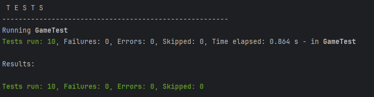

# Программа-турнир игроков
_Цель:_ научиться использовать коллекции при работе с наборами элементов; протестировать программу, добившись качественного кода

# Входные данные

- необходимо создать дата-класс Player c полями id, name, strength
- необходимо создать менеджер Game для управления турниром игроков, с методом регистрации игроков register и методом round (String playerName1, String playerName2) для соревнования двух игроков  по силе
- все зарегистрированные игроки должны храниться в списке в поле класса Game
- если один из игроков в турнире не зарегистрирован, должно выбрасываться исключение NotRegisteredException
- метод round должен возвращать одно число: если сила первого игрока больше - 1, если сильнее второй игрок - 2, если ничья  - 0
- необходимо написать тесты на класс Game со 100% покрытием по бранчам (JaCoCo)
- в отдельной ветке fast необходимо доработать предыдущую задачу, заменив список игроков на HashMap и добиться, чтобы все тесты проходили
-  сделать Pull Request ветки fast к основной ветке, но не применять его

# Выходные данные

- программа реализована согласно заданию
- тесты проходят
- успешная сборка

mvn clean verify

